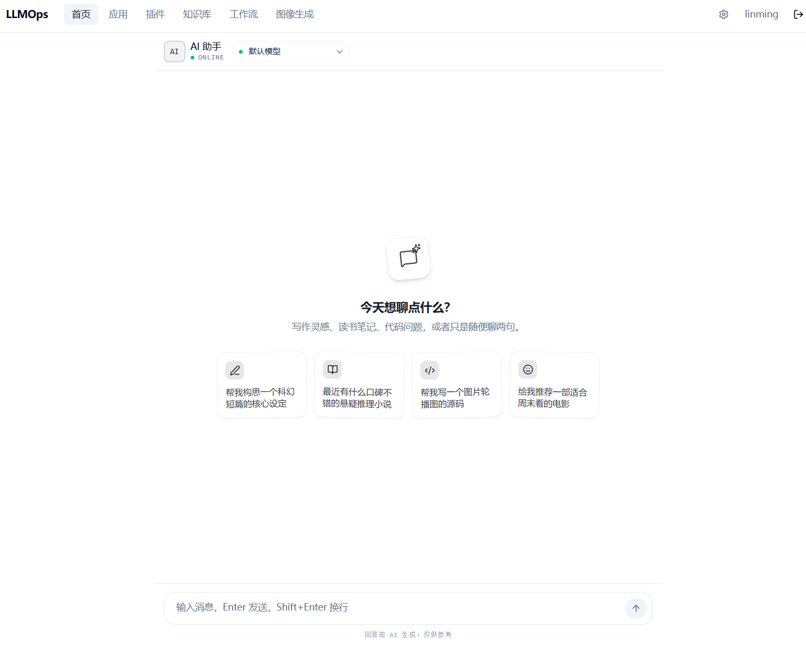
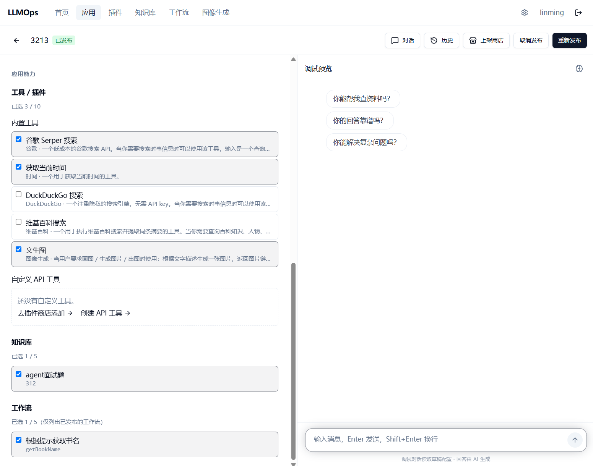
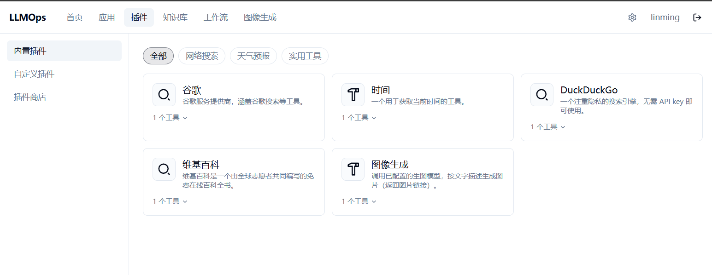
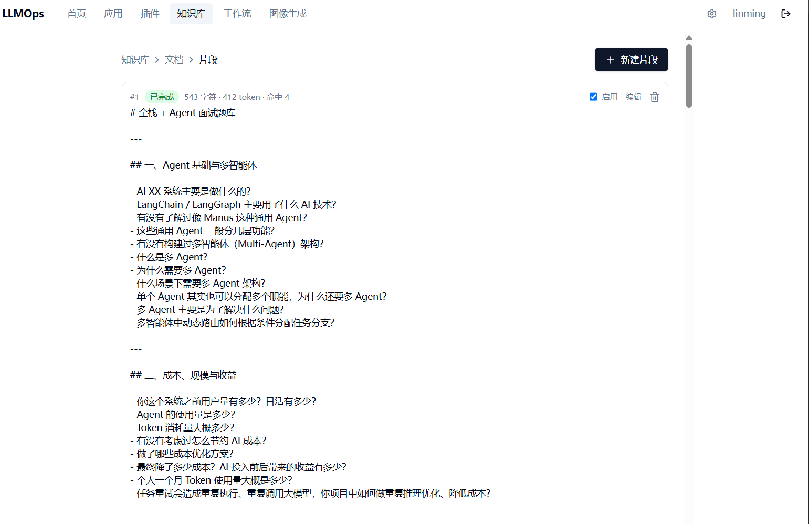
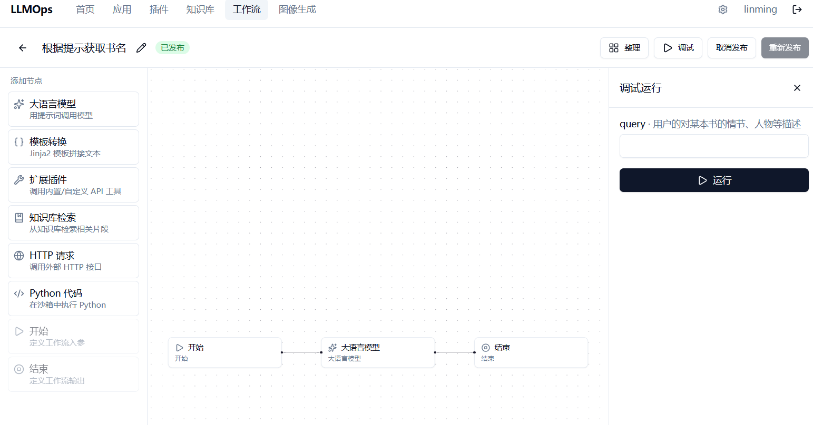
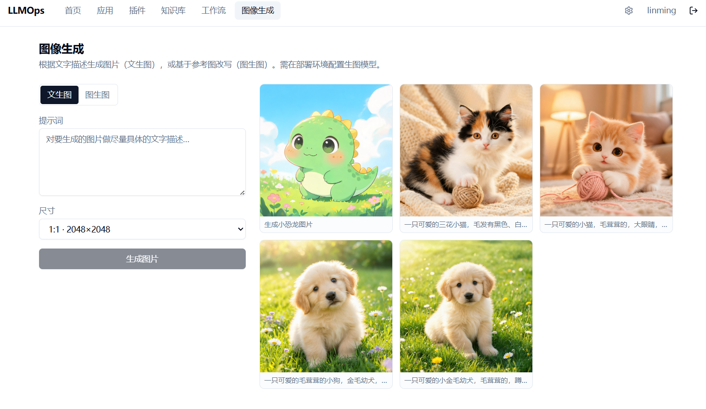

# linming_llmops

[](LICENSE)
[](../../actions/workflows/ci.yml)

> **An open-source, Docker‑one‑click‑deployable LLMOps platform** — app orchestration, streaming chat (SSE), a RAG knowledge base, built‑in & API tools, and an assistant agent. Self‑contained lightweight auth, OpenAI‑compatible by default, local embeddings out of the box. Bring up the whole stack with `docker compose up`.

`linming_llmops` 是一个**开源、可 Docker 一键部署的 LLMOps 平台**：应用编排 + 流式对话（SSE）+ RAG 知识库 + 工具/插件 + 助手 Agent + 可视化工作流。内置轻量登录（无需外部网关），默认对接 OpenAI 兼容接口，知识库向量化走**本地嵌入模型**——干净主机上三条命令即可起完整栈、浏览器直接使用。

---

## 📸 界面预览

<table>
  <tr>
    <td width="50%">
      <br>
      <sub><b>首页</b> · 开箱即用的 AI 助手对话（流式 SSE、可切模型、预设开场白）</sub>
    </td>
    <td width="50%">
      <br>
      <sub><b>应用编排</b> · 配模型 / 工具 / 知识库 / 工作流，右侧实时调试，一键发布</sub>
    </td>
  </tr>
  <tr>
    <td width="50%">
      <br>
      <sub><b>插件</b> · 内置工具（搜索 / 时间 / 百科 / 生图）+ 自定义 API 工具，分类浏览</sub>
    </td>
    <td width="50%">
      <br>
      <sub><b>知识库</b> · 文档自动切分为片段，含字符 / Token / 命中数，可启用与编辑</sub>
    </td>
  </tr>
  <tr>
    <td width="50%">
      <br>
      <sub><b>工作流编排</b> · 拖拽 8 类节点连成 DAG，右侧逐节点流式调试运行</sub>
    </td>
    <td width="50%">
      <br>
      <sub><b>图像生成</b> · 文生图 / 图生图 + 历史画廊，也作为内置工具供 Agent 出图</sub>
    </td>
  </tr>
</table>

---

## ✨ 功能特性

- **应用编排** — 创建并配置 AI 应用（模型、提示词、工具、知识库、对话开场白等 14 项配置），一处编排、多处调用。
- **流式对话（SSE）** — 基于 POST + `ReadableStream` 的框架无关流式协议，逐 token 实时返回，支持中断/停止。
- **RAG 知识库** — 文档导入 → 自动切分 → 向量索引（Qdrant）→ 语义/混合检索与命中测试；向量化由**本地嵌入模型**完成，检索本身不需要付费 key。
- **工具 / 插件** — 内置工具框架 + 自定义 API 工具（OpenAPI/HTTP），让 Agent 调用外部能力。
- **助手 Agent** — 可绑定工具与知识库的对话式 Agent，支持多轮工具调用。
- **可视化工作流** — 拖拽式编排多节点工作流（开始/结束/LLM/模板/工具/知识库检索/HTTP/代码 8 类节点），逐节点流式调试运行，发布后可作为工具被应用调用。
- **图像生成** — 文生图 / 图生图（OpenAI 兼容生图端点）+ 历史画廊；也作为内置工具，让带工具的 Agent 在对话中直接出图。
- **LLM 目录与管理** — 多供应商/多渠道模型目录，渠道凭证落库加密、多渠道兜底熔断。
- **OpenAPI 外部调用** — 以 API Key 鉴权的对外接口，供第三方系统集成。
- **文件上传与管理** — 本地磁盘存储（S3/MinIO 适配器接口预留）。

> **v1.1**：可视化工作流、图像生成**已交付**；TTS 进行中。详见 [`docs/ROADMAP.md`](docs/ROADMAP.md)。

---

## 🧱 架构一览

```
                ┌─────────────────────────────────────────────┐
   浏览器  ───▶ │  frontend  (nginx)                          │
                │   • Vite + React 18 SPA 静态托管             │
                │   • /api 反向代理（SSE 不缓冲）              │
                └───────────────┬─────────────────────────────┘
                                │  /api
                ┌───────────────▼─────────────┐   ┌──────────────────────┐
                │  backend  (Flask + gunicorn) │   │  celery-worker        │
                │   • REST + POST-SSE          │   │   • 文档解析/向量索引 │
                │   • 轻量登录(JWT) + OpenAPI  │   │   • 异步任务          │
                └───────┬──────────┬───────────┘   └──────────┬───────────┘
                        │          │                          │
            ┌───────────▼──┐  ┌────▼─────┐  ┌─────────────────▼──┐
            │  MySQL 8     │  │  Redis   │  │  Qdrant            │
            │  业务数据    │  │ 缓存/队列│  │  向量库            │
            └──────────────┘  └──────────┘  └────────────────────┘
```

- 嵌入模型：本地 `BAAI/bge-small-zh-v1.5`（512 维，首启自动下载到缓存卷）。
- `backend` 与 `celery-worker` 共享上传文件卷（web 存上传 → worker 读取并索引）。
- 技术栈：后端 **Flask 3.1 + injector DI + SQLAlchemy + Alembic + Celery**；前端 **Vite + React 18 + TypeScript + TanStack Query + Zustand + Tailwind**；基础设施 **MySQL 8 / Redis 7 / Qdrant**。

详尽设计见 [`docs/ARCHITECTURE.md`](docs/ARCHITECTURE.md)。

---

## 🚀 快速开始（Docker 一键部署）

干净主机（装好 Docker + Docker Compose）上三步起完整栈：

```bash
# 1) 准备配置
cp deploy/.env.example deploy/.env

# 2) 编辑 deploy/.env，至少改这几项：
#    JWT_SECRET、AI_SECRET_ENCRYPT_KEY、MYSQL_ROOT_PASSWORD  → 改成随机长串
#    OPENAI_API_KEY（或兼容端点 OPENAI_BASE_URL）           → 对话 / RAG 需要 LLM

# 3) 起栈（首次会构建镜像、下载嵌入模型，耐心等几分钟）
docker compose -f deploy/docker-compose.yml --env-file deploy/.env up -d --build
```

启动完成后浏览器打开 **http://127.0.0.1:8080**（端口由 `FRONTEND_PORT` 决定），注册账号即可使用。

端到端冒烟（注册 → 建应用 → SSE 对话 → 建知识库 → RAG 检索）：

```bash
bash deploy/smoke-test.sh
```

> 部署细节、国内镜像加速、服务/端口/卷说明、SSE 不缓冲自查、轻量模式等见 [`deploy/README.md`](deploy/README.md)。

---

## ⚙️ 配置参考

`deploy/.env.example` 是精简模板（只列必填与最常用项）；完整可调项参考见 [`deploy/README.md`](deploy/README.md#完整变量参考)。最常用的几项：

| 变量 | 作用 | 生产是否必改 |
|---|---|---|
| `JWT_SECRET` | 登录令牌签名密钥 | ✅ 必改（随机长串） |
| `AI_SECRET_ENCRYPT_KEY` | provider/渠道 API Key 落库加密 | ✅ 必改（改后旧密文需重填） |
| `MYSQL_ROOT_PASSWORD` | 数据库密码 | ✅ 必改 |
| `OPENAI_API_KEY` / `OPENAI_BASE_URL` | 对话 / RAG 的 LLM 凭证（或兼容端点） | 用对话/RAG 则填 |
| `FRONTEND_PORT` | 前端对外端口（默认 8080） | 按需 |
| `INSTALL_ML` | 是否装本地嵌入栈（RAG 需要，默认 true） | 默认即可 |
| `HF_ENDPOINT` | 嵌入模型下载镜像（国内设 `https://hf-mirror.com`） | 国内建议 |
| `QDRANT_API_KEY` | 向量库鉴权（默认无） | 生产建议填 |

供应商/模型（OpenAI 兼容、Anthropic、DeepSeek、火山 Ark 可选；本地嵌入；可选图像/TTS）的配置指南见 [`docs/PROVIDERS.md`](docs/PROVIDERS.md)。

---

## 🛠️ 本地开发

详见 [`CONTRIBUTING.md`](CONTRIBUTING.md)。速览：

```bash
# 后端（backend/，Python 3.11+）
pip install -r requirements.txt -r requirements-dev.txt
SQLALCHEMY_DATABASE_URI="sqlite:////tmp/dev.db" JWT_SECRET=test AI_SECRET_ENCRYPT_KEY=test pytest

# 前端（frontend/，Node 18+）
npm ci
npm run test       # vitest
npm run build      # typecheck + 构建
```

---

## 📦 项目结构

```
backend/    Flask API + Celery worker + Alembic 迁移
frontend/   Vite + React + TypeScript SPA（nginx 容器）
deploy/     docker-compose.yml + .env.example + smoke-test.sh + README
docs/       架构、路线图、供应商配置指南
```

---

## 🗺️ 路线图

v1 已交付：基础设施 → 轻量登录 → 数据模型/迁移 → 核心 AI 引擎 → 服务/存储 → 前端 SPA → Docker 一键部署 → 开源发布。
v1.1：可视化工作流编辑器、图像生成**已交付**；TTS 进行中。

完整阶段表与状态见 [`docs/ROADMAP.md`](docs/ROADMAP.md)。

---

## 🔒 安全

默认凭证必须修改、密钥管理与漏洞上报方式见 [`SECURITY.md`](SECURITY.md)。

## 🤝 贡献

欢迎 issue 与 PR，约定见 [`CONTRIBUTING.md`](CONTRIBUTING.md)。

## 📄 License

[Apache License 2.0](LICENSE)。
